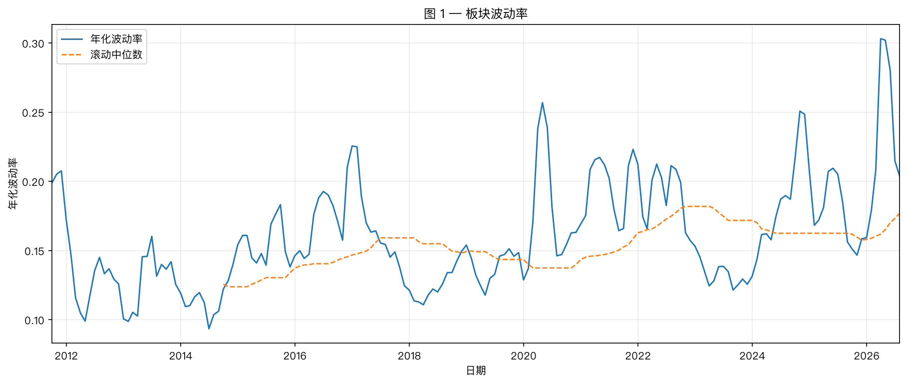
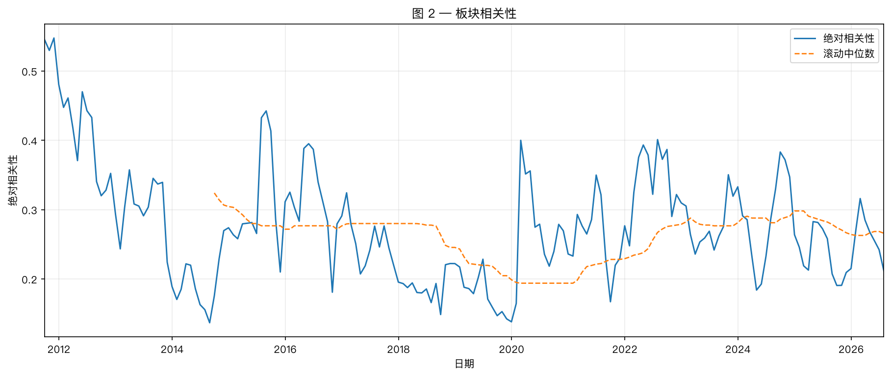
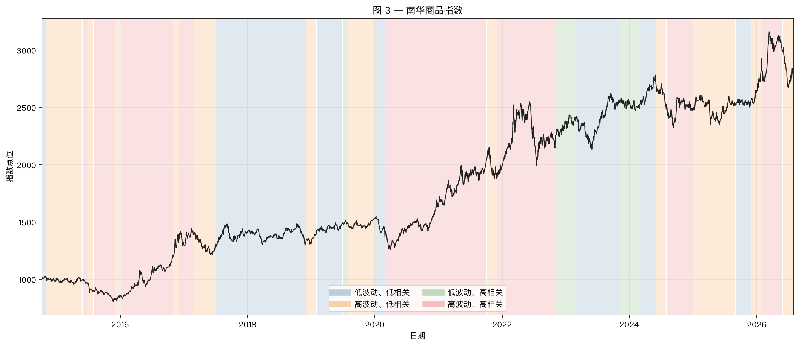
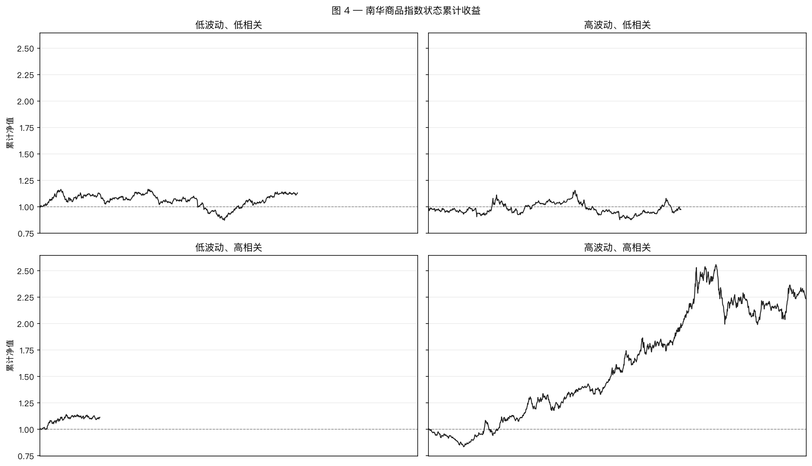
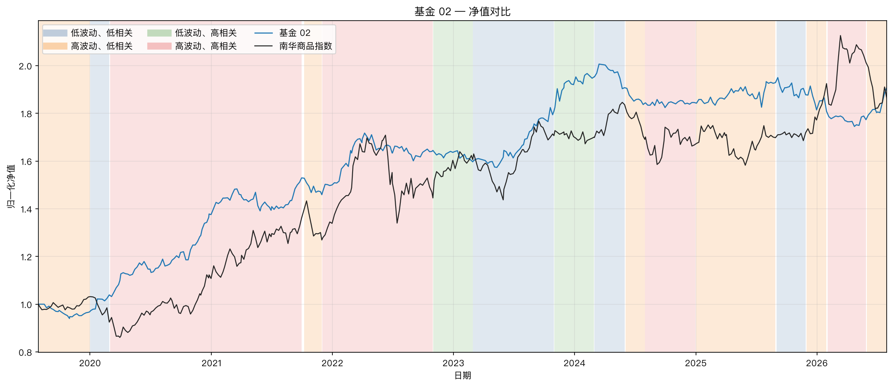
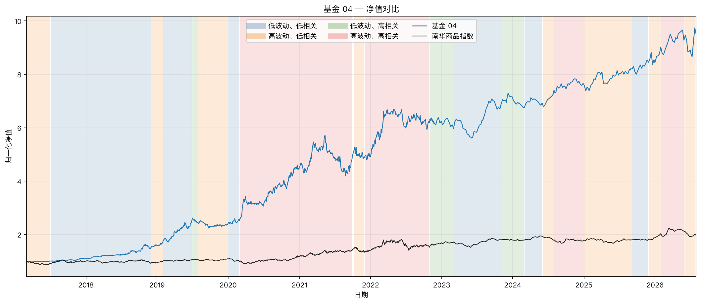
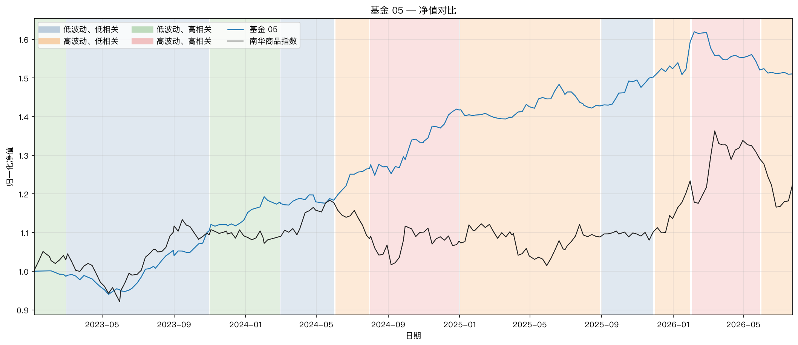
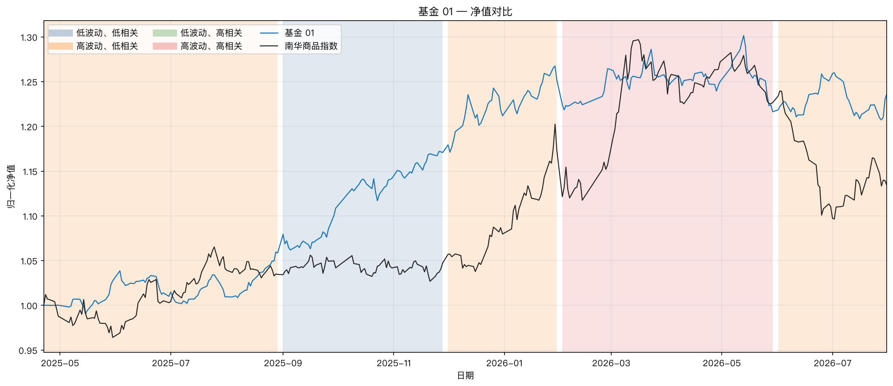
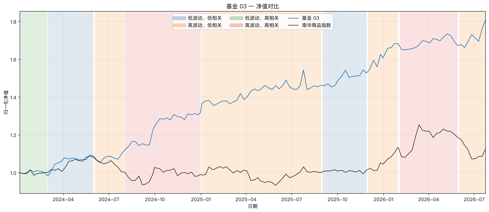
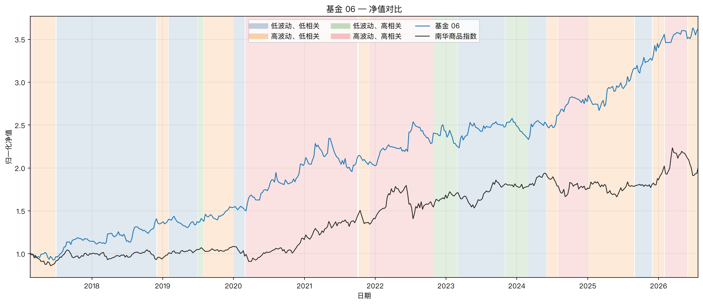

# 国内商品市场波动率—相关性状态与CTA表现：复现报告

> 参考研报：[When Do Trend Followers Make Money?](https://www.cmegroup.com/content/dam/cmegroup/education/files/when-do-trend-followers-make-money.pdf)

## 1. 研究目的

原研报以资产波动率和资产间绝对相关性共同刻画趋势跟踪策略的市场环境，并将市场划分为四类状态。其核心结论是：趋势跟踪策略在“低波动、低相关”和“高波动、高相关”状态下表现较好，而在波动率与相关性一高一低时表现偏弱。

本文使用国内商品期货和私募基金净值，对这一结论进行近年样本复现。由于研究范围仅包含国内商品期货，且状态阈值采用滚动方法，因此属于方法框架的本土化检验，而非对原研报的严格同口径复制。

## 2. 数据与方法

商品期货数据覆盖 **2011-07-01至2026-08-03**，南华商品指数覆盖 **2011-07-01至2026-07-31**。样本包含89个有效商品品种，映射至11个板块。

主要口径如下：

- 每日以完成 ramp-in 的有效品种为等权基准形成板块收益；新增品种和新板块采用六个月线性 ramp-in，日度聚合按当日有效权重重新归一化；
- 每月基于此前三个自然月板块收益计算年化波动率，并对板块等权平均；
- 相关性取板块两两收益相关系数的绝对值，再按两个板块的 ramp-in 权重乘积加权平均；
- 高低状态以当月之前36个完整月的滚动中位数划分；
- 月末确定的状态从下一个交易日起生效；
- 基金与南华商品指数仅在共同有效日期内比较，收益和夏普比率按实际净值频率年化。

与原研报相比，本文有三项主要差异：研究对象由全球多资产期货改为国内商品期货；横截面聚合采用板块等权并对新增成员线性渐进纳入；状态阈值由全样本中位数改为过去三年滚动中位数。

## 3. 商品市场状态

### 3.1 波动率与相关性

商品市场波动率具有明显的阶段性。2012—2015年整体较低，2016—2017年和2020—2022年明显上升；2024年以来波动率再度抬升，并在2026年达到样本高位附近。

绝对相关性并未与波动率同步变化。相关性在2014—2015年及2019—2020年较低，在2015—2017年、2022年和2024—2025年阶段性回升。这说明波动率和相关性提供了不同维度的信息，不能仅凭市场涨跌幅判断CTA环境。

### 3.2 四类市场状态

四种状态在样本期内均有出现，但持续时间不均衡。其中“低波动、高相关”状态明显较少，后续绩效统计受样本量限制更强。

## 4. 南华商品指数的条件表现

| 市场状态 | 日度样本数 | 年化收益 | 夏普比率 | 原研报CTA夏普 |
|---|---:|---:|---:|---:|
| 低波动、低相关 | 843 | 2.77% | 0.28 | 0.9 |
| 高波动、低相关 | 765 | -2.80% | -0.12 | 0.1 |
| 低波动、高相关 | 191 | 31.00% | 1.69 | 0.0 |
| 高波动、高相关 | 1117 | 17.53% | 1.01 | 1.1 |

在三个月指标、三年阈值和 ramp-in 口径下，南华商品指数的四状态排序仍保留部分原研报特征，但状态间差异发生变化：

- **高波动、高相关**状态下收益和夏普仍较高；
- **高波动、低相关**状态下收益为负；
- **低波动、高相关**状态样本较少，但本次样本中的年化收益和夏普最高；
- **低波动、低相关**状态收益接近零，未呈现旧口径下同样强的优势。

因此，在商品市场指数层面，新口径下最强表现出现在低波高相关和高波高相关状态，高波低相关最弱，原研报关于“同高或同低更优”的排序仅得到部分复现。不过，这一结果描述的是商品指数本身的条件收益，并不能直接等同于趋势CTA收益。

## 5. CTA基金结果

六只基金在不同状态下的夏普比率如下。为便于阅读，产品按策略身份分为“截面”和“趋势”两类；该分类仅用于展示分组，不构造类别组合，也不改变单产品统计口径：

| 基金 | 低波低相关 | 高波低相关 | 低波高相关 | 高波高相关 |
|---|---:|---:|---:|---:|
| 截面—基金02 | 0.76 | 0.50 | 1.21 | 1.51 |
| 截面—基金04 | 3.40 | 1.15 | 1.36 | 2.13 |
| 截面—基金05 | 2.34 | 0.91 | 2.71 | 1.13 |
| 趋势—基金01 | 4.87 | 2.78 | — | -0.45 |
| 趋势—基金03 | 2.66 | 1.69 | 2.58 | 1.82 |
| 趋势—基金06 | 1.33 | 1.01 | -0.62 | 1.20 |

### 5.1 截面类产品

### 5.2 趋势类产品

基金层面的证据较为混合：

- 基金04在低波低相关和高波高相关状态下表现较好，低波高相关仍有正收益；
- 基金01样本较短，只覆盖两种状态，暂不足以完整检验；
- 截面类基金02、基金04、基金05之间也未呈现完全一致的四象限排序；基金04在低波低相关和高波高相关状态下表现较好，基金05在低波高相关状态下相对突出。
- 趋势类基金01、基金03、基金06同样存在明显差异；基金01样本较短，只覆盖两种状态，基金06的低波高相关状态为负。

这是因为样本中的CTA产品并非同质的长期趋势策略，其中包括截面和趋势两大类，其收益来源不同，不能预期其对波动率—相关性状态具有相同反应。

## 6. 结论

本次复现得到两层结论：

1. **商品市场层面部分复现。** 南华商品指数在低波高相关和高波高相关状态下表现较好，高波低相关状态最弱；状态排序与原研报并不完全一致。
2. **CTA基金层面仅部分复现。** 只有部分基金表现符合原研报，基金之间存在明显异质性，当前结果不足以支持“国内CTA整体遵循同一四象限规律”的强结论。

因此，更准确的表述是：

> 波动率—相关性框架能够有效区分国内商品市场的不同环境，并对部分CTA产品具有解释力，但其解释效果取决于产品是否真正具有显著的时间序列趋势暴露。
